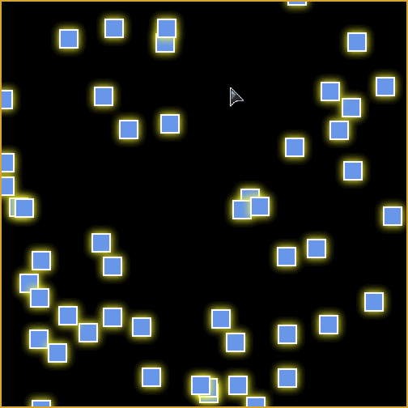

# sophii.co working files

This repo is a collection of javascript files to support the website [sophii.co](sophii.co). There are scripts for ["avoidance cloud" effect](packages/avoidance/README.md) and for creating a scrollwheel side-scrolling page.


## Quick Start

The two easiest ways to use the scripts from this repo are

1. to CDN directly to the distributable JS files, transpiled and ready to use directly in the browser; or
2. to install to your project via a package manager such as npm or yarn.

See the instructions below for each specific script and how to access the entry points.

### avoidance.js

<p align="center">
  
  Make HTML elements avoid your mouse cursor and touches, beautifully.
  
</p>

#### For CDN:

Paste the following into your HTML, either inside `<head>` or at the end of `<body>`.

```html
<script src="https://cdn.jsdelivr.net/gh/stephen-zhao/sophii.co/packages/avoidance/dist/avoidance.var.min.js">
```

#### For Packaged:

Run one of the following:
```sh
yarn add @zhaostephen/avoidance
```
```sh
npm install --save @zhaostephen/avoidance
```

#### Usage:

Add the following javascript.

```js
    new Avoidance('#my-container').start();
```

Replace `#my-container` with the query selector for the container on which you want the mouse-over/touch effect to occur. All children elements will then be animated as particles.

For more details on the what customizable options and functionality are available, see the [avoidance.js readme](packages/avoidance/README.md).

### gallery-case-scroll.js

> Note: This script is not yet available in the general library form, and therefore cannot yet be conveniently used. A library-ification is scheduled to be done eventually.

This script currently requires `jQuery`. See <https://code.jquery.com/>.

Use the following code in your HTML to import the script via CDN, after jQuery is imported:

```html
<script src="https://cdn.jsdelivr.net/gh/stephen-zhao/sophii.co/dist/gallery-case-scroll-v0.3.2.txt">
```

## Roadmap

- `avoidance.js`:
  - See [TODO](packages/avoidance/README.md#todo)
- `gallery-case-scroll.js`:
  - needs library-ification
  - needs documentation
  - basically needs a complete rework


## Extra Usage Tips

The javascript needs to execute after DOM has loaded for it to register all of the elements that it needs to work with.
To do this, either use jQuery's `$(...)` function, like so:

```html
<script>
  $(function() {
    new Avoidance('#my-container').start();
  });
</script>
```

or place a self-executing function at the end of the HTML body, like so:

```html
<html>
  <body>
    <!-- all the things! -->
    <script>
      (function() {
        new Avoidance('#my-container').start();
      })();
    </script>
  </body>
</html>
```
