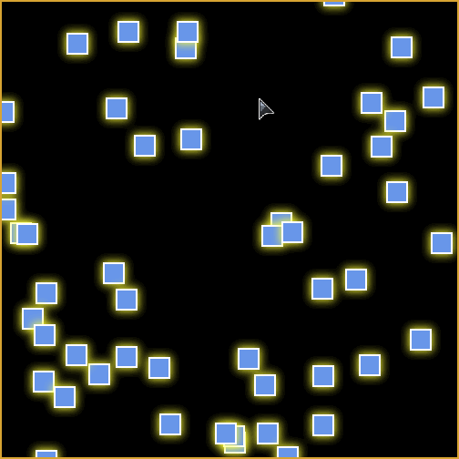

# avoidance.js


Make HTML elements avoid your mouse cursor and touches, beautifully.



## Quick Start

The two easiest ways to use **avoidance.js** are

1. to CDN directly to the distributable browser-ready JS; or
2. to install to your project via a node package manager such as yarn.

### To CDN:

Paste the following into your HTML, either inside `<head>` or at the end of `<body>`, before any javascript that makes use of it.

```html
<script src="https://cdn.jsdelivr.net/gh/stephen-zhao/sophii.co/packages/avoidance/dist/avoidance.var.min.js">
```

### To install to node project:

Run in one of the following (depending on your package manager):

```sh
yarn add @zhaostephen/avoidance
```
```sh
npm install --save @zhaostephen/avoidance
```

### To use:

#### Import

If using with modules, first import the library's main entry point. If using directly in browser, skip this step.

```js
  import Avoidance from "@zhaostephen/avoidance";
```

#### Create and run

Then simply instantiate an `Avoidance` on the container of your choice, and call start.

```js
    new Avoidance('#my-container').start();
```

Replace `#my-container` with the query selector for the container on which you want the mouse-over/touch effect to occur. All children elements will then be animated as particles.

## TODO

- support rotation animation
- add typedefs in typescript (especially for the API)
- needs API documentation
- needs features highlight in README
- needs documentation for available options
